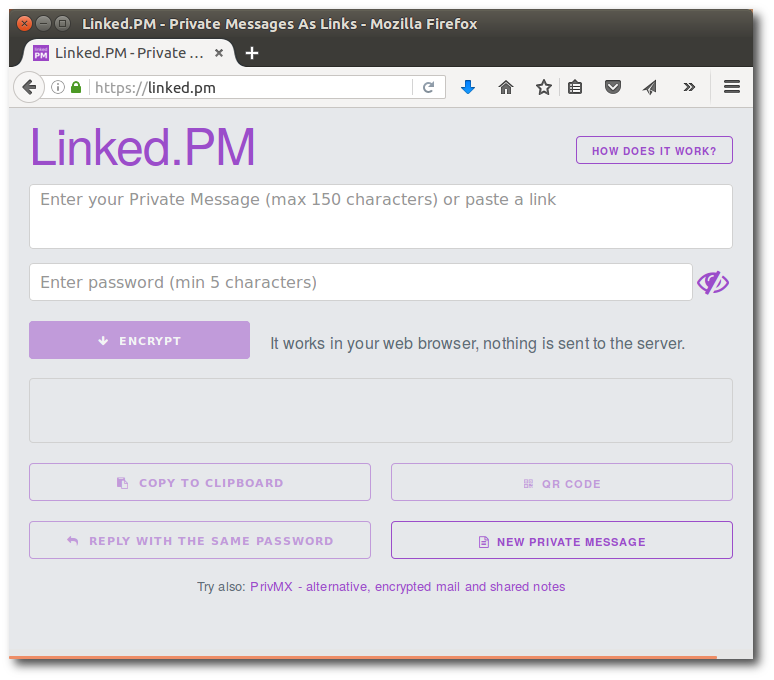
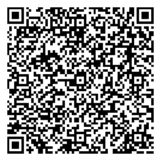

# Linked.PM

A single-file browser-based application which turns your private messages into 
clickable, encrypted links.

Set a shared secret (password) with your friends and send "linked" PMs through 
unencrypted channels (email, sms, facebook etc) or paste them into documents 
(also in the form of QR code). 

[  ](https://linked.pm)

## Example 

The QR code below contains a Linked PM:

[  ](https://linked.pm/#AQ83Ok5xYqYr1lx8ZwHRCyIQ7G8BBY0PZPhJDjoonQfIJsFUlA34m9qJj+3ZEjwagnFOVC0ALWWAhOGT51go3b4I9cL8rgytd023LFQFlwXC/X2oVP6NEjK4Phv5jdXHKC34yg==)

The password is *topsecret*.

## Details

Messages are encrypted using AES-CCM cipher (Advanced Encryption Standard (AES) 
in Counter with CBC-MAC Mode (CCM)) and 256 bits key computed from your password 
using 10000 rounds of PKDF2 key derivation algorithm.
During each encryption additional parameters like salt and IV (initialization vector) 
are randomly generated, so it is unlikely that the same message with the same password 
will generate the same link next time you use linked.pm.

The ciphertext (with salt and IV) is stored in the hash part of URL and its processing 
is exclusively client-side with no participation from the server (browsers do not send 
this part of URL to the server). 

In fact you can save linked.pm application (a single file) on your desktop 
and use it offline.

## Build

To build the application follow these steps:

```
git clone https://github.com/simplito/linked-pm.git
cd linked-pm
npm install
gulp
```

The resulting apllication file can be found in `dist/index.html`.

## License 

The MIT License (MIT)

Copyright (c) 2016 Simplito Inc.

Permission is hereby granted, free of charge, to any person obtaining a copy
of this software and associated documentation files (the "Software"), to deal
in the Software without restriction, including without limitation the rights
to use, copy, modify, merge, publish, distribute, sublicense, and/or sell
copies of the Software, and to permit persons to whom the Software is
furnished to do so, subject to the following conditions:

The above copyright notice and this permission notice shall be included in
all copies or substantial portions of the Software.

THE SOFTWARE IS PROVIDED "AS IS", WITHOUT WARRANTY OF ANY KIND, EXPRESS OR
IMPLIED, INCLUDING BUT NOT LIMITED TO THE WARRANTIES OF MERCHANTABILITY,
FITNESS FOR A PARTICULAR PURPOSE AND NONINFRINGEMENT. IN NO EVENT SHALL THE
AUTHORS OR COPYRIGHT HOLDERS BE LIABLE FOR ANY CLAIM, DAMAGES OR OTHER
LIABILITY, WHETHER IN AN ACTION OF CONTRACT, TORT OR OTHERWISE, ARISING FROM,
OUT OF OR IN CONNECTION WITH THE SOFTWARE OR THE USE OR OTHER DEALINGS IN
THE SOFTWARE.
